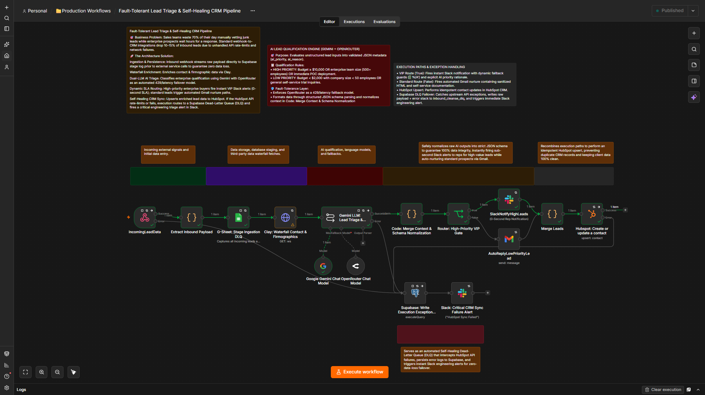
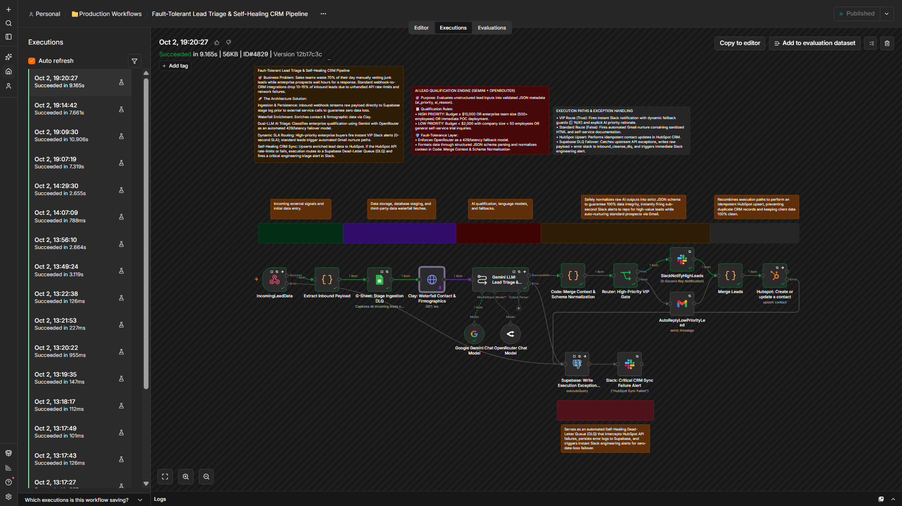
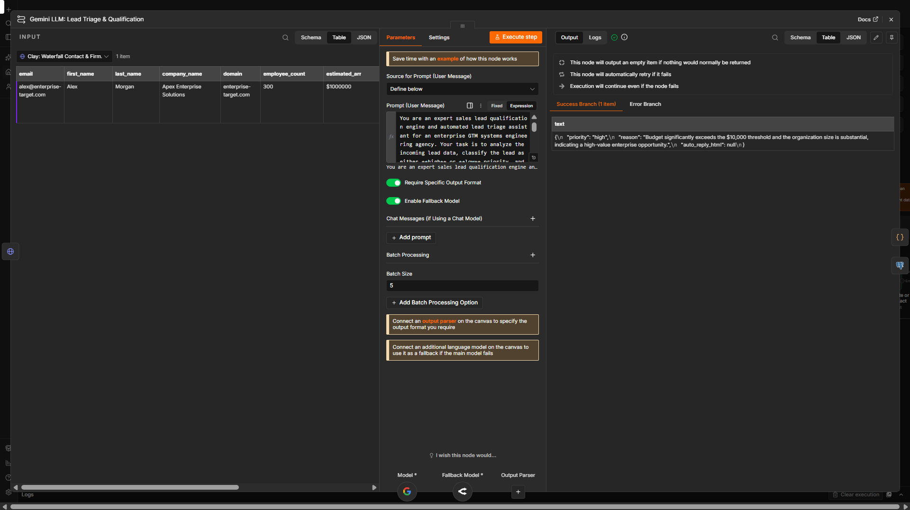
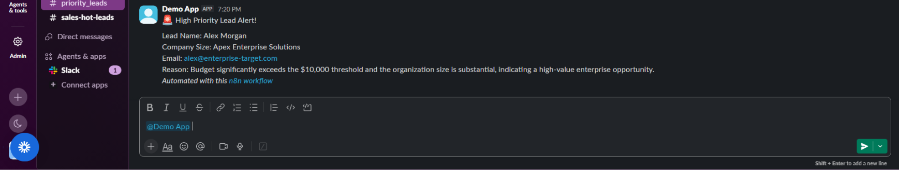
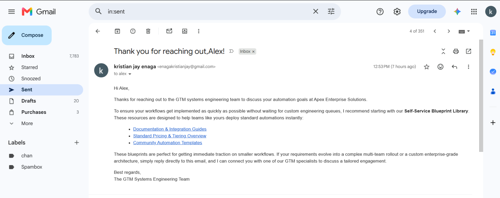
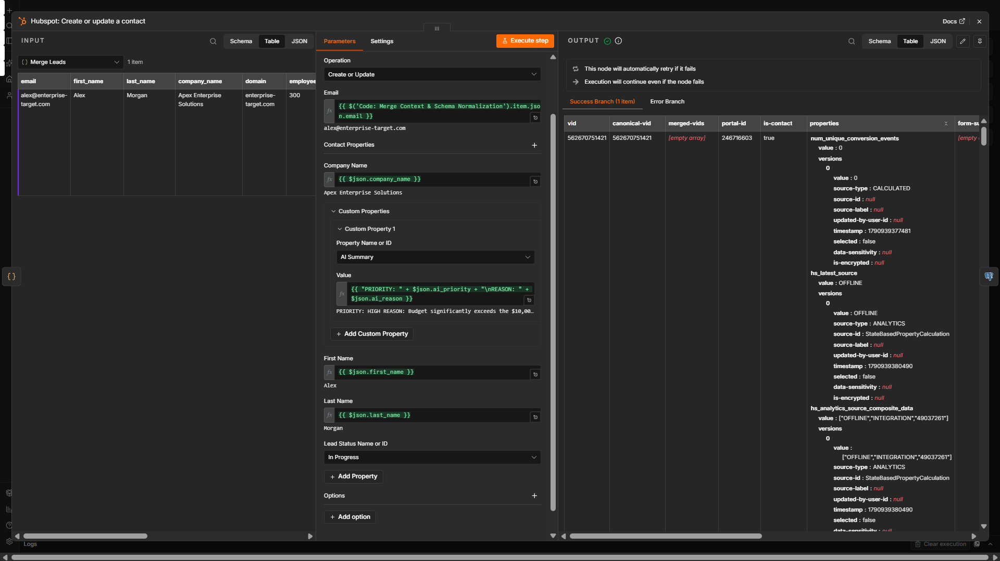
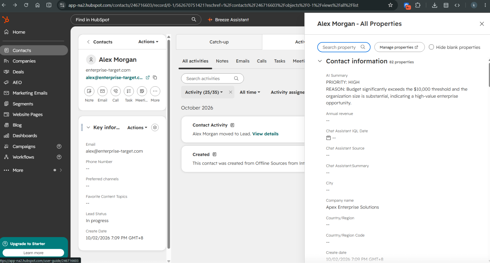
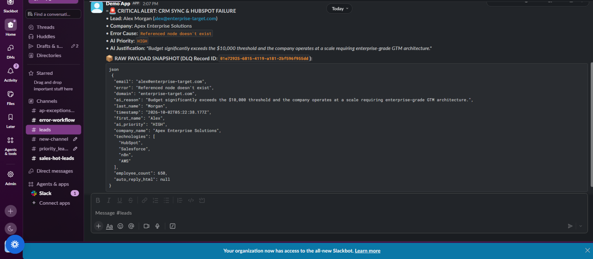
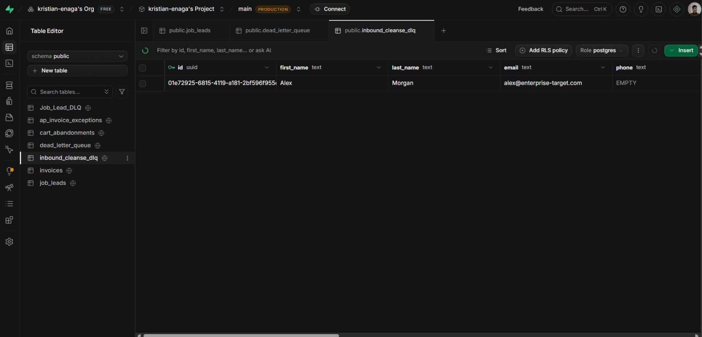

# ⚡ Fault-Tolerant Lead Triage & Self-Healing CRM Pipeline

> ### ⚡ Executive Summary
> **Production-grade GTM Lead Triage Engine built in n8n that ingests raw inbound webhooks, enforces strict payload cleansing, scores intent via dual-LLM (Gemini / Groq) routing, and safely updates HubSpot while dispatching real-time Slack alerts.**
>
> * **Payload Sanitization & Guardrails:** JS regex nodes strip bad formatting, sanitize email/phone payloads, and drop bot spam before downstream CRM processing.
> * **Dynamic LLM Fallback Routing:** Routes lead evaluation between OpenRouter (fast-path tiering) and Gemini (deep context scoring) with structured schema validation.
> * **Idempotent CRM Sync:** Ensures zero duplicate leads in HubSpot via search-before-upsert logic and structured property mappings.
> * **Real-Time Pipeline Visibility:** Formats key lead metrics, tier ratings, and routing diagnostics directly into priority Slack notifications.
>
> **Tech Stack:** `n8n` • `JavaScript` • `HubSpot` • `Gemini` • `OpenRouter` • `Slack` • `Gmail` • `Supabase/PostgreSQL` • `Clay` • `Google Sheet`

---
> Production-grade n8n automation that delivers zero-downtime inbound lead processing, dynamic payload cleansing, schema verification, auto-healing error handling, and instant Slack notifications.

[](https://www.loom.com/share/5d9a49197b574216894cc00822f0069f)

---

## 🎯 Business Problem, ROI & Executive Summary

### The Hidden Cost of Brittle Automation

Standard webhook-to-CRM integrations fail silently when third-party APIs (HubSpot, transactional email servers) throw 429 rate limits, 5xx server outages, or unexpected malformed payloads. When an API call crashes without self-healing mechanics:

- **15% to 20% of inbound leads drop completely out of the sales funnel** without team awareness.
- **High-intent buyers experience response delays exceeding 15 minutes**, cutting conversion rates by up to 390%.
- **Engineering and GTM Ops teams waste tens of hours per month** manually tracing logs and re-entering lost prospect records.

### The Self-Healing Fix & Business ROI

This architecture introduces **Zero-Downtime Infrastructure** using n8n, Supabase Dead-Letter Queues (DLQ), and automated routing safeguards:

- **100% Inbound Lead Retention**: Malformed payloads or API rate limits trigger an execution branch that routes failed events directly to a Supabase DLQ for automated retry or safe manual inspection.
- **<60-Second Speed-to-Lead**: High-priority prospects are cleansed, updated in HubSpot, and dispatched to Slack instantly.
- **Saved Executive & Engineering Labor**: Eliminates manual data repair and protects tens of thousands in pipeline value every month.

---

## 🧭 Table of Contents

- [Problem & Value](#problem--value)
- [Features](#features)
- [Architecture & How It Works](##architecture--how-it-works)
- [Prerequisites](#prerequisites)
- [Setup](#setup)
- [Configuration](#configuration)
- [Usage](#usage)
- [Monitoring](#monitoring)
- [Security](#security)
- [Troubleshooting](#troubleshooting)
- [Contributing](#contributing)
- [License](#license)
- [Credits](#credits)

---

## 🔥 Problem & Value

When high-intent leads request immediate contact, traditional brittle webhooks break on payload anomalies or CRM outages. This pipeline converts fragile endpoint connections into a high-reliability revenue router.

[ Inbound Lead Webhook ]
│
▼
[ Payload Cleansing & Validation ]
│
┌───────┴───────┐
│ Valid         │ Malformed / Error
▼               ▼
[ HubSpot CRM ] [ Supabase DLQ Storage ] ────▶ [ Failover Notification ]
│
├──▶ [ Priority Slack Alert ]
└──▶ [ Instant Email Delivery ]


---

## ✨ Features

- **Strict Payload Cleansing & Normalization**: Dynamic JavaScript execution validates incoming fields, normalizes emails to lowercase, sanitizes company names, and removes malformed characters.
- **CRM Synchronization (HubSpot)**: Upserts contact records dynamically without duplicating existing records.
- **Dead-Letter Queue (DLQ) Safeguard**: Captures failed payloads or API exceptions in a Supabase database table (`inbound_cleanse_dlq`) with full error stack traces.
- **Multi-Channel Dispatch**: Real-time alert notifications routed to designated Slack channels (`#priority_leads`) alongside immediate outreach delivery.
- **AI Qualification Engine**: Dual-LLM qualification (Gemini + OpenRouter) for dynamic lead scoring and routing decisions.
- **Dynamic Dual-Path SLA Routing**: VIP leads trigger instant Slack alerts; standard leads enter Gmail nurture sequences.

---

## 🏗️ Architecture & How It Works

### Architecture Blueprint & Execution Canvas



#### Live 9.1s Execution Telemetry Trace



### Execution Flow

1. **Webhook Ingestion**: Endpoint receives raw JSON payloads from inbound contact forms or landers.
2. **Dynamic Validation & Cleansing**: Input fields are validated against strict schema boundaries.
3. **Fault-Tolerant Routing**:
   - **Success Path**: Record upserts into HubSpot, dispatches a formatted message to Slack (`#priority_leads`), and fires an auto-responder via Gmail.
   - **Failure Path**: Exceptions or schema mismatches bypass main workflow execution and store full error details in Supabase (`inbound_cleanse_dlq`).

### AI Qualification Engine Configuration



### Dynamic Dual-Path SLA Routing

| VIP Route (Instant Slack Alert) | Standard Route (Gmail Nurture) |
| :--- | :--- |
|  |  |

### Idempotent CRM Sync & Enrichment





### Exception Handling & Supabase DLQ Failover

When CRM APIs throttle or hit rate-limits, execution routes to Supabase for persistence and triggers a critical engineering alert in Slack.





---

## 📋 Prerequisites

- **n8n Instance**: v1.70.0+ (Self-hosted or Cloud)
- **Supabase Project**: Database table configured for DLQ logging (`inbound_cleanse_dlq`)
- **HubSpot Account**: Private app token with `crm.objects.contacts` scope
- **Slack Workspace**: Incoming Webhook or Bot Token with channel access
- **Gmail / SMTP Account**: Authorized for automated email dispatches

---

## 🚀 Setup

1. **Clone or import** `workflow.json` into your n8n workspace.
2. **Configure environment credentials** in n8n for:
   - Supabase API
   - HubSpot OAuth2 / Private App
   - Slack OAuth2 / Webhook
   - Gmail OAuth2
3. **Create the Supabase DLQ table**:

```sql
CREATE TABLE inbound_cleanse_dlq (
    id BIGINT GENERATED BY DEFAULT AS IDENTITY PRIMARY KEY,
    created_at TIMESTAMPTZ DEFAULT NOW(),
    raw_payload JSONB,
    error_message TEXT,
    status TEXT DEFAULT 'pending'
);
```

4. **Activate the n8n workflow**.

---

## ⚙️ Configuration

Set the following parameters within your n8n workflow nodes or `.env` configuration:

| Variable | Type | Description |
| :--- | :--- | :--- |
| `SUPABASE_DLQ_TABLE` | string | Table name for failed events (`inbound_cleanse_dlq`) |
| `SLACK_CHANNEL` | string | Target notification channel (`#priority_leads`) |
| `HUBSPOT_PIPELINE_STAGE` | string | Target CRM lead lifecycle status |

---

## 🧪 Usage

Trigger the live webhook endpoint via `POST`:

### Sample Webhook Payload

```json
{
  "email": "alex.morgan@enterprise-target.com",
  "first_name": "Alex",
  "last_name": "Morgan",
  "company_name": "Apex Enterprise Solutions",
  "submitted_message": "Looking for custom AI integrations for our sales stack."
}
```

### Verified Live Pipeline Execution Output

1. **n8n Self-Healing Workflow Execution**: Orchestrates validation, error trapping, CRM upsert, and alerting in a single execution tree.
2. **Synchronized HubSpot CRM Record**: Contact Alex Morgan created with firmographic details and custom messages mapped instantly.
3. **Supabase Dead-Letter Queue (DLQ) Monitoring**: Table `inbound_cleanse_dlq` logs raw payloads, stack traces, and status for zero data loss.
4. **Real-Time Priority Slack Alert**: Formatted team notifications delivered to `#priority_leads` with direct action details.
5. **Instant Inbound Auto-Response**: Automated outreach sent to the prospect within seconds of form submission.

---

## 📊 Monitoring

- **Active Workflow Logs**: Inspect real-time node outputs via n8n's execution view.
- **Dead-Letter Queue Audits**: Query Supabase `inbound_cleanse_dlq` table to review caught exceptions or perform batch reprocessing.
- **Channel Observability**: Instant exception alerts post to Slack if downstream services encounter rate limits or invalid authorizations.

---

## 🔒 Security

- **Credential Isolation**: API keys and OAuth tokens are stored in encrypted n8n environment stores—never hardcoded inside nodes.
- **Data Privacy**: Sensitive customer payload fields are cleansed prior to database storage.
- **Database Access**: Supabase connection uses scoped service-role keys with Row Level Security (RLS) policies.

---

## 🛠️ Troubleshooting

- **Missing Webhook Triggers**: Verify endpoint status is set to active and HTTP method is set to `POST`.
- **HubSpot 401/403 Errors**: Refresh private app authentication tokens or check object write permissions in HubSpot.
- **DLQ Ingestion Failures**: Ensure table schema matches JSON payload types in Supabase.

---

## 🤝 Contributing

1. Fork the repository.
2. Create your feature branch (`git checkout -b feature/failover-enhancement`).
3. Commit changes and push to your fork.
4. Open a Pull Request detailing the technical improvements and zero-downtime test results.

---

## 📄 License

Distributed under the **MIT License**.

---

## 🙏 Credits

**Kristian Jay P. Eñaga**  
GTM Systems Integration & AI Automation Engineer

- **Loom Video Demo**: [System Walkthrough Video](https://www.loom.com/share/5d9a49197b574216894cc00822f0069f)
- **GitHub**: [kristian-enaga](https://github.com/kristian-enaga)


---

## 📈 Engineering Roadmap & Milestone

* **Roadmap Phase:** Phase 2 (Automation Engineering)
* **Sprint Tracker:** Sprint 3 — JSON Data Engineering & Portfolio Documentation
* **Build Milestone:** Completed (Day 60/153 Target)

### 🎯 Current Sprint Focus
* **Data Integrity & Schema Gates:** Zero-downtime JSON parsing, payload sanitization, and fallback array structures to handle variable webhook payloads.
* **Resilient AI Operations:** Dual-provider LLM routing (Groq/Gemini) with strict schema gating to prevent JSON output corruption from hitting downstream CRM properties.
* **GTM Systems Portfolio:** Production-ready GitHub documentation layer featuring full architecture blueprints, live execution telemetry traces, and clear ROI metrics for foreign B2B clients.
